# ProceduralCityGenerator
CityGenerator v 0.1 is a WPF/DirectX tool to generate meshes of cities or other structures with export possibility to game engines like Unity 3d or others.

This tool can be easily extended to use models instead of 3d figures.

### Day 0 - Inspiration
I like medieval or fantasy games like Dark Souls and The Witcher but I’m loved in Sci-fi worlds and cities. My inspirations to this demo are sci-fi cites from cyberpunk universes like Ghost in the shell, Infinity The Game, Android Netrunner, Eve Online and Blade Runner.

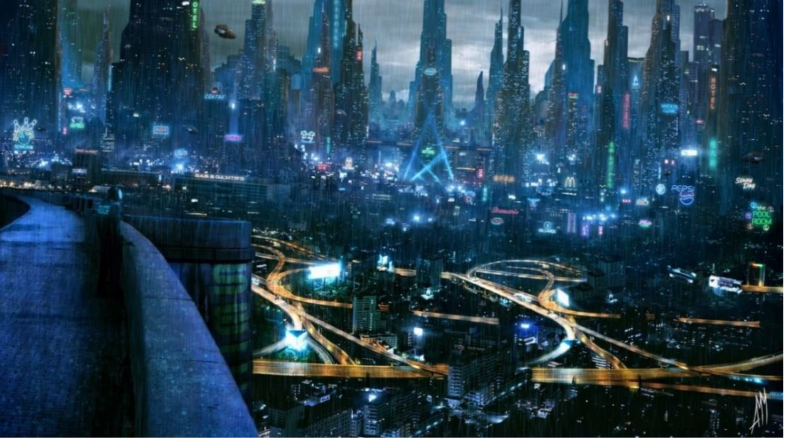

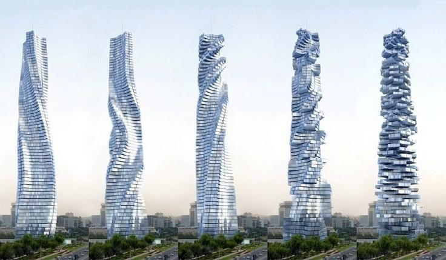

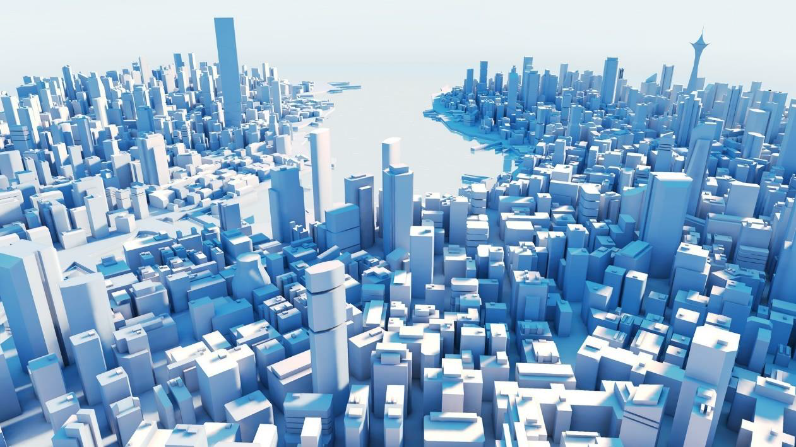

### Unity 3D & WPF close integration
Close integration like using Unity 3D Scene in WPF or WPF ViewPort in unity 3D is almost impossible. Of course, all in IT is possible but decompiling Unity 3D or WPF is time-consuming. Unity scene or packages are binary formats so it also requires some kind of reverse engineering.

There is a way to create reusable code with external DLLs. I used it one time with OpenCV and EMGU in Unity 3d for face detection with Kinect but I have a lot of problems with it. It's a time-consuming method and in my opinion, is not worth it. Unity 3D doesn't use .NET but Mono so you need to recompile the whole library. Also, the Mono version that Unity 3D is using does not support even the all of .NET 2.0 features (!).

Of course, you can implement some logic in .NET 2.0 and use it with the 4.5 WPF tool with multi-targeting options but you need to compile some code in Mono for Unity. But there is another problem: recreating visual preview of the scene in Unity 3D and in WPF ViewPort as far as I know there isn't any framework to do this.

### Possible approaches with WPF and Unity 3d integration

If you are creating a tool to generate meshes with materials in WPF and export scene to *.obj or import from *.obj or other 3D common formats it’s not a problem but things can go tricky if you want to use something more complicated or uncommon for example objects like shaders, lights, animations, colliders or other features that WPF don’t provide. One way to integrate the tool with Unity 3d and Unity 3d with your tool is your own protocol or format, for example, XML and reconstruction on both sides based on information in the file. This solution has one disadvantage you need to write code for each 3d tool for example Unreal Engine, 3dsmax, blender, TopoGun, etc as plugins.

I decided to export data in *.obj and *.mtl format for meshes and materials, it’s a simple and common format for 3d models. It’s also possible to create/reconstruct other objects like shaders, colliders, etc in MenuEdit Helper plugin for Unity 3D.
It’s also possible to migrate lights and animations (Animatable class) from WPF to Unity 3D but you need to have come contract for each object to recreate it in Unity 3D from XAML/XML. It might be also possible to migrate even shaders with SharpDX integration. These things are not implemented yet due to time-consuming. I had enough problems with *.obj export mainly with localization and textures.

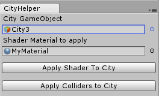

### Day 1 - Proof of concept as Unity 3D plugin
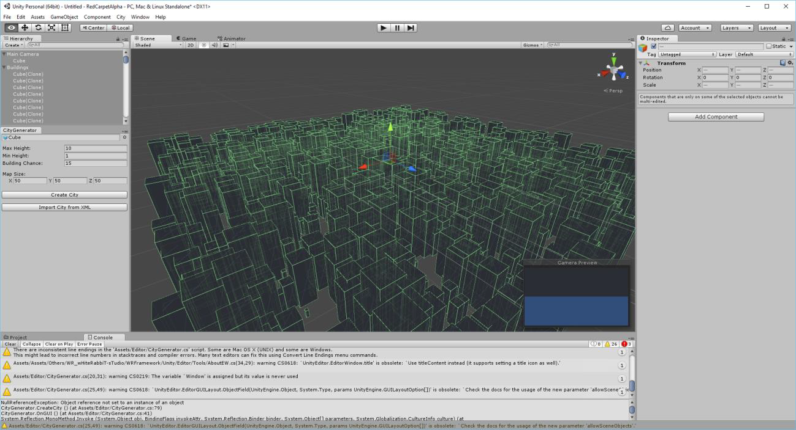

### Day 5 - WPF tool
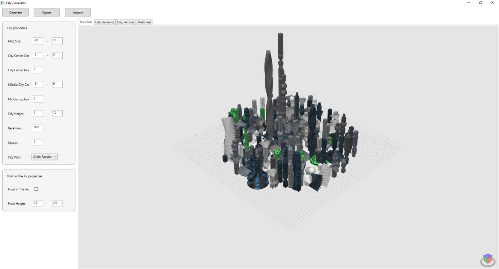

### Day 8 - Exported meshes in Unity 3d game engine
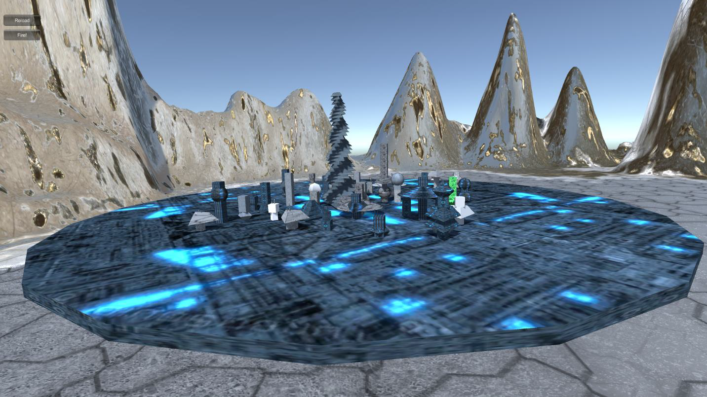
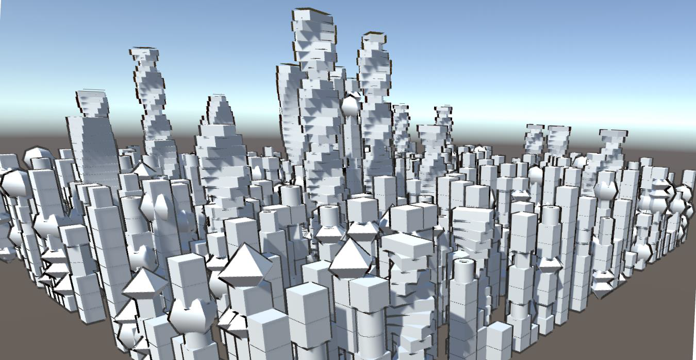

### Day 11 - Exported meshes in Unity 3d game engine
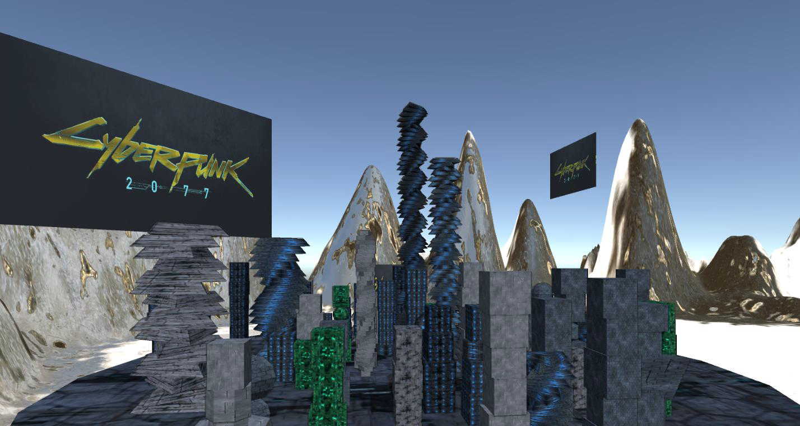

### Day 12 - Exported meshes in Unity 3d game engine
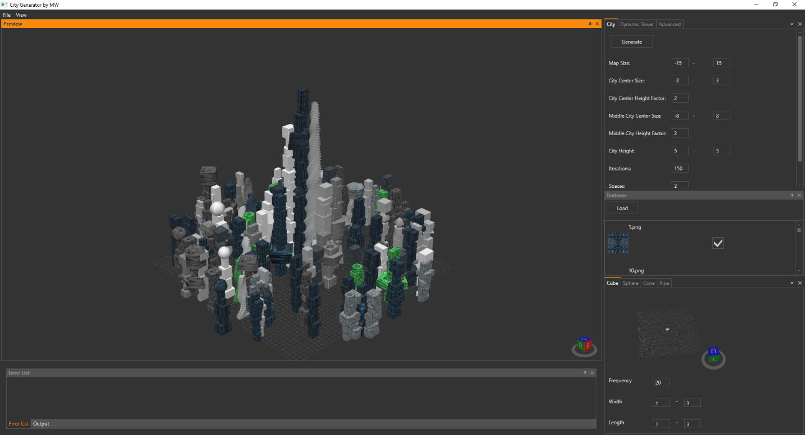

Lacking motivation and inspiration? Creating sci-fi cities? Just use my tool in single building mode with low iterations and small map size and random city plan.
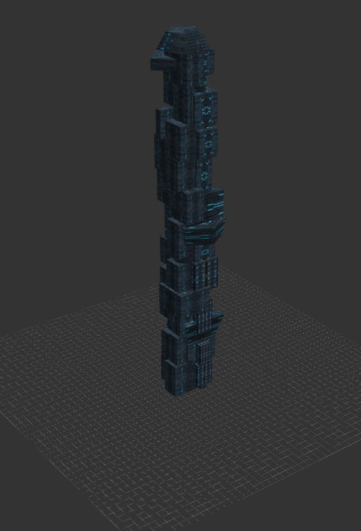

### Using this tool in the future real-life scenario
In the future workflow will be as follow:
- 3d modeler with texture graphic create city segments,
- Tool load segments of the city from *.obj or other format and procedurally generated whole cities or just buildings based on segments with changeable logic.

### Parameters
Each module has min/max parameters for example width, height, etc. if you want to get a preview of each of them you need to wait 5 seconds or click “Generate preview” to reload it.

Remember that is only a demo and some parameters are not validated for example you can't create a sphere with a lack of triangles.

If you want to disable the module use Frequency 0 property.

You can also enable/disable textures and load them from external folder as *.jpg, *.jpeg, *.png files.

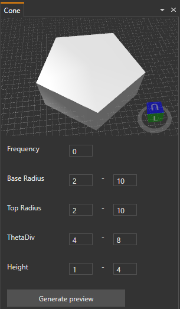
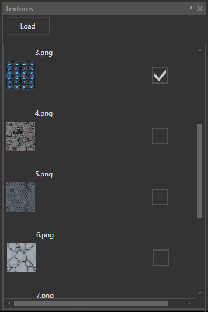
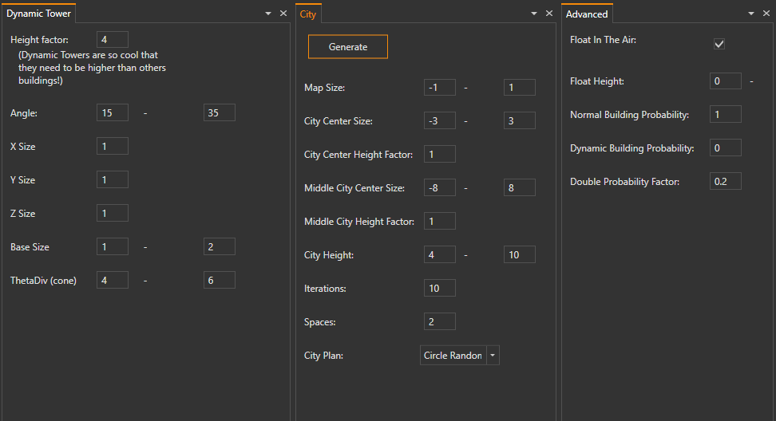

Currently, there are only 2 types of buildings, normal ones created from random modules and dynamic towers. Each dynamic tower might be made of cones or cubes with a 50/50 probability.

You can specify the map size of the city center, middle city, and rest of the city with parameters for city size. Also, you can use the height factor to scale your city in these areas.

Iterations are just a number of buildings created in one generation.
Spaces and city plans are not fully supported by now and need to be changed and tested but you can try them out as they are today.

Float in the air (advanced option) is a feature for creating elements in distances for example for cities with super anti-gravity boson Higgs technology or just to create fancy single buildings.

You can also change the probability of each building type.

A double factor (advanced option) is a scalar that can change the probability of module functionality. If you want more ordered buildings for example cubes with 0.5, 1, 1.5, 2.0 lengths you should set it on 0.5.

Dynamic towers have x,y,z size factors and min/max angle random per element per building. In future, it might have different angles like a tower in the inspiration section.

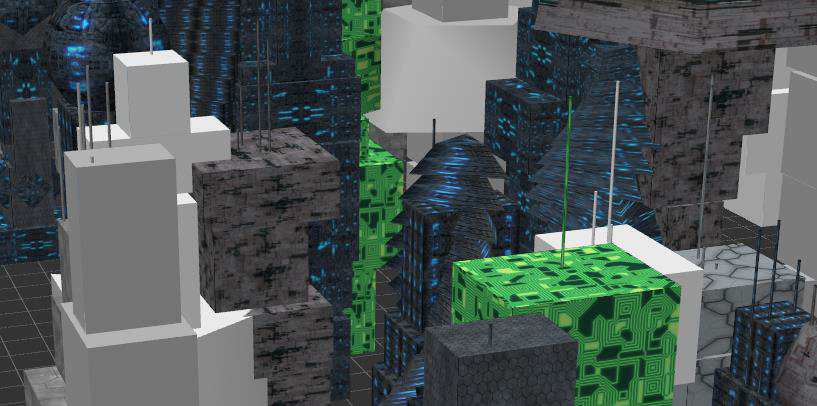
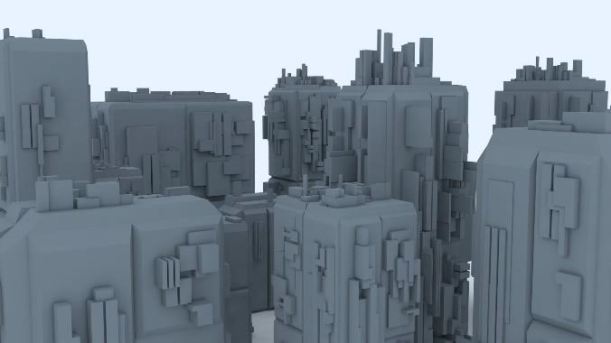
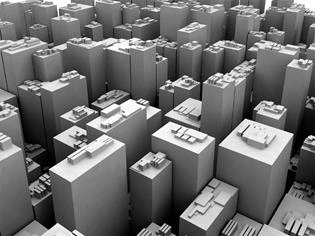